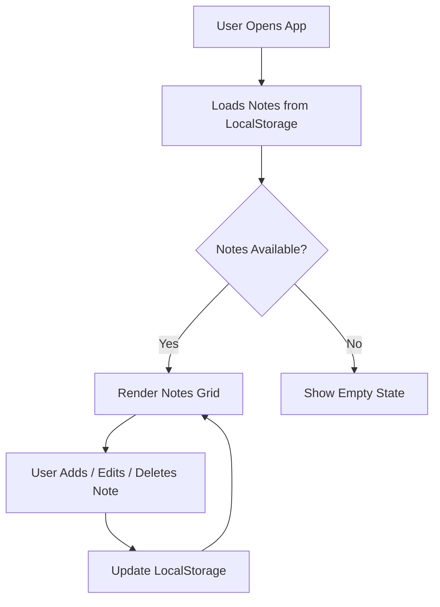
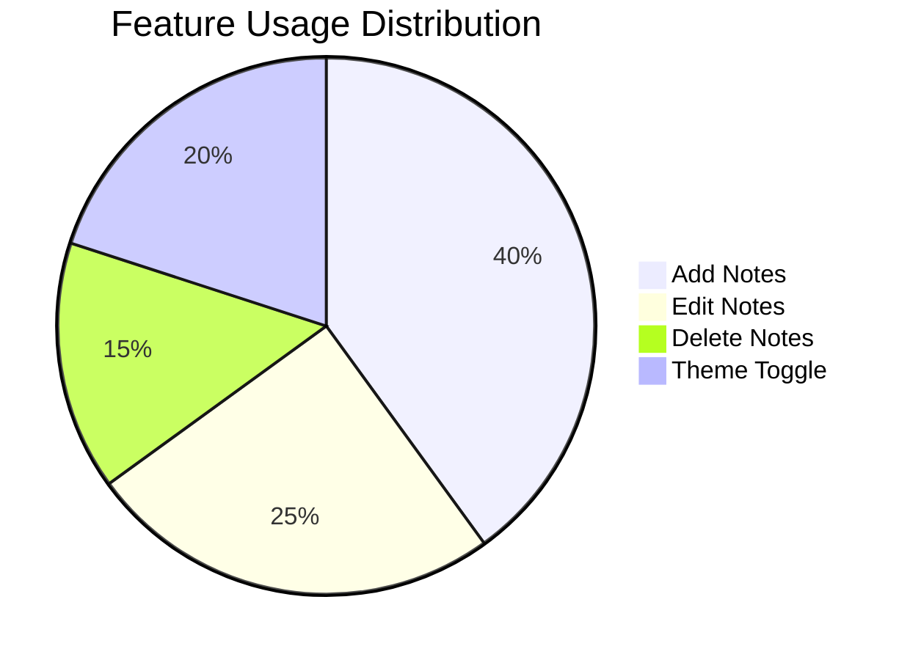

# NoteApp
# ✨ Elegant Notes — Smart & Stylish Note App

<p align="center">
  
  
  
  
</p>

---

## 🚀 Live Preview

🔗 **Try it here:**
👉 https://ayushnandi718-dev.github.io/NoteApp/

---

## 🎬 App Preview (Animated)

<p align="center">
  
</p>

---

## 🧠 What is Elegant Notes?

**Elegant Notes** is a modern, animated, and minimal note-taking web app designed for speed, simplicity, and style.
It lets you create, edit, and manage notes with a beautiful UI and smooth transitions.

---

## ⚡ Features

✨ **Create Notes Instantly**
📝 **Edit & Delete with One Click**
💾 **Auto Save using LocalStorage**
🌙 **Dark / Light Mode Toggle**
🎨 **Random Color Highlights per Note**
📱 **Fully Responsive Design**
⚡ **Smooth Animations & Transitions**

---

## 📊 App Behavior Flow



---

## 📈 Feature Usage Graph



---

## 🖥️ Tech Stack

| Technology               | Usage                 |
| ------------------------ | --------------------- |
| **HTML5**                | Structure             |
| **CSS3**                 | Styling & Animations  |
| **JavaScript (Vanilla)** | Logic & Interactivity |
| **LocalStorage**         | Data Persistence      |

---

## 🎨 UI Highlights

* Glassmorphism Inspired Design
* Animated Card Hover Effects
* Gradient Typography
* Smooth Modal Dialog Animations
* Dynamic Color Accents

---

## 📂 Project Structure

```
📁 Elegant Notes
├── index.html
├── style.css
├── main.js
└── README.md
```

---

## ⚙️ How It Works

1. Click **+ Add Note**
2. Enter title & content
3. Save → instantly appears
4. Stored in browser (no backend needed)

---

## 🧩 Core Logic (Simplified)

```javascript
const notes = JSON.parse(localStorage.getItem('notes')) || [];

function saveNote(note) {
  notes.unshift(note);
  localStorage.setItem('notes', JSON.stringify(notes));
}
```

---

## 🌗 Theme System

* 🌙 Dark Mode (Default)
* ☀️ Light Mode Toggle
* Preference saved automatically

---

## 💡 Future Improvements

* 🔍 Search Notes
* 📌 Pin Important Notes
* ☁️ Cloud Sync
* 🏷️ Tags & Categories
* 📤 Export Notes

---

## 👨‍💻 Author

**Ayush Nandi 🇮🇳**
💡 Passionate about clean UI & creative web apps

---

## ⭐ Support

If you like this project:

👉 Give it a ⭐ on GitHub
👉 Share it with your friends
👉 Build your own version 🚀

---

<p align="center">
  
</p>

---
