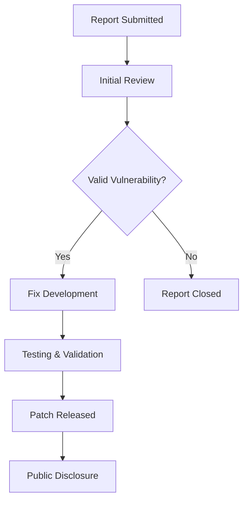
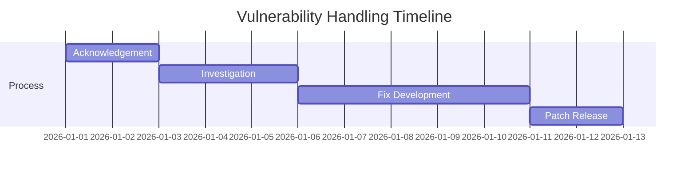

# 🔐 Security Policy

  
  
  

---

## 🛡️ Supported Versions

We actively maintain and provide security updates for the following versions:

| Version | Supported |
| ------- | --------- |
| 5.1.x   | ✅ Yes     |
| 5.0.x   | ❌ No      |
| 4.0.x   | ✅ Yes     |
| < 4.0   | ❌ No      |

---

## 📊 Security Response Flow

---

## 🚨 Reporting a Vulnerability

If you discover a security issue, please report it responsibly.

### 📩 How to Report

* 📧 Email: **[security@yourdomain.com](mailto:security@yourdomain.com)** *(replace with your real email)*
* 📝 Include:

  * Clear description of the issue
  * Steps to reproduce
  * Screenshots / proof of concept (if possible)
  * Impact explanation

---

## ⏱️ Response Timeline

* ✅ **Acknowledgement:** within **24–72 hours**
* 🔍 **Investigation:** within **3–5 days**
* 🛠️ **Fix Release:** depends on severity (usually within a week)

---

## 🔎 What to Expect

### ✔️ If Accepted:

* You’ll receive confirmation
* Issue will be fixed and tested
* Patch will be released
* Optional credit (if you want recognition)

### ❌ If Declined:

* Clear explanation will be provided
* Suggestions (if applicable)

---

## ⚠️ Security Best Practices

* Do **not** publicly disclose vulnerabilities before reporting
* Avoid exploiting issues beyond proof-of-concept
* Keep reports **ethical and responsible**

---

## 🧠 Scope

This policy covers:

* Core application logic
* LocalStorage handling
* UI input validation
* Browser-based vulnerabilities

---

## 🤝 Responsible Disclosure

We believe in **safe, transparent, and ethical security practices**.
Your contribution helps make this project safer for everyone.

---

  

---
